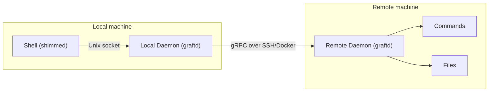
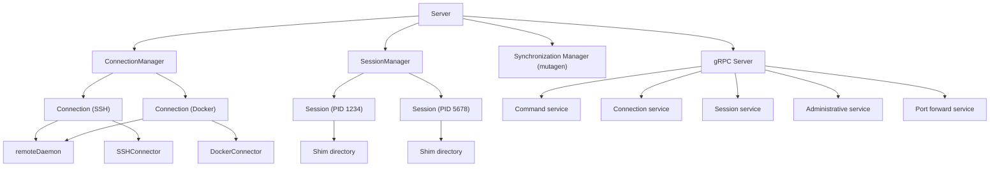
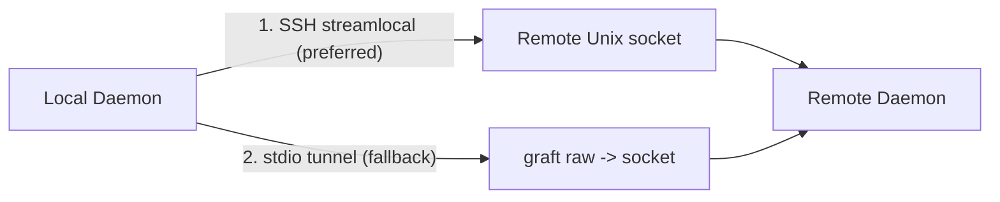
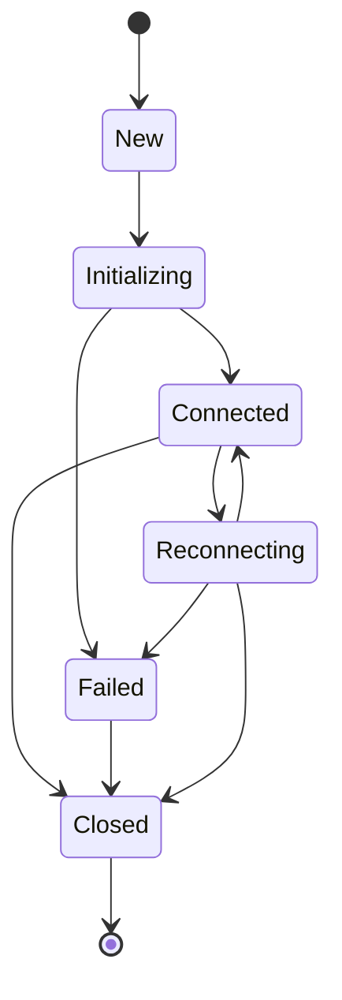
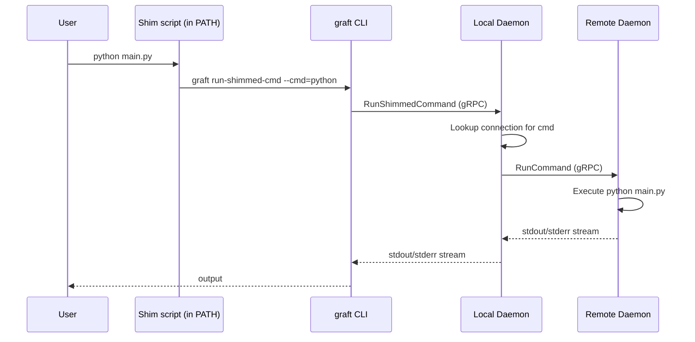
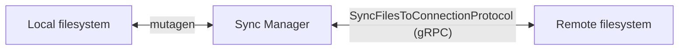
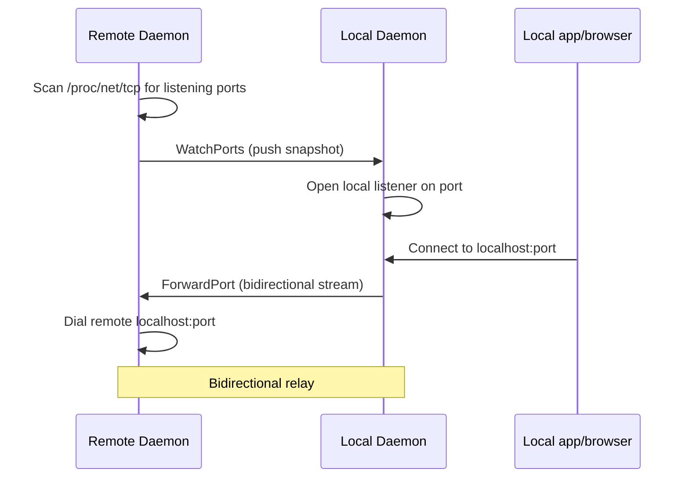

# Architecture

Graft is a local-first remote development platform. It runs commands and syncs files on remote machines (SSH or Docker) while making them feel local.

## Overview



The system has two tiers: a **local daemon** on your machine and a **remote daemon** on each target. Both are the same `graft` binary running in different modes (`graft daemon` vs `graft daemon --as-remote`). They communicate over gRPC.

## Server internals



## Daemons

### Local daemon

The local daemon listens on a Unix socket at `~/.local/state/graft/local/graftd.sock`. It manages:

- **Connections** - SSH and Docker connections to remote machines
- **Sessions** - active shell sessions and their shimmed commands
- **Synchronization** - bidirectional file sync via mutagen
- **Port forwarding** - automatic forwarding of remote listening ports

Clients (the `graft` CLI) talk to the local daemon over this socket using gRPC.

### Remote daemon

The local daemon automatically installs and manages the remote daemon. On first connection:

1. Discovers the remote OS, architecture, and home directory
2. Copies the appropriate `graft` binary via SCP (SSH) or `docker cp` (Docker)
3. Starts it with `bash -ic 'graft daemon --as-remote'`

The remote daemon listens on `~/.local/state/graft/remote/graftd.sock` on the remote machine. It handles command execution, command discovery, file sync endpoints, and port scanning.

### gRPC transport

The local daemon connects to the remote daemon's Unix socket in one of two ways:



1. **SSH Unix socket forwarding** (preferred) - the SSH client dials the remote socket directly via `streamlocal` channel
2. **Stdio tunnel** (fallback) - runs `graft raw` over SSH/Docker exec, which dials the socket and pipes stdin/stdout. An `ACK` handshake confirms the connection before gRPC traffic begins.

In both cases the resulting `net.Conn` is wrapped into a `grpc.ClientConn` using a passthrough dialer.

### Reconnection

A health check runs every second. If the remote daemon becomes unreachable, the connection enters `Reconnecting` state and retries with exponential backoff (1s to 30s). Reconnection re-initializes the transport, checks the daemon, and reinstalls if the version has drifted.

## Connections

A connection represents a link to a remote machine. It has a name, a destination URI (e.g. `ssh://user@host`), optional local/remote root directories, and forwarding/sync configuration.

### Connection states



| State | Meaning |
|---|---|
| Initializing | Transport and daemon setup in progress |
| Connected | Ready for commands |
| Failed | Initialization failed |
| Reconnecting | Health check failed, retrying |
| Closed | Torn down |

### Daemon sharing

Multiple connections to the same host share a single remote daemon via reference counting. When the last connection to a host is removed, the daemon is destroyed.

### Configuration

Connections are persisted in `~/.config/graft/local/config.yml`:

```yaml
connections:
  - name: dev
    destination: ssh://user@host
    localRoot: /home/user/project
    remoteRoot: /home/user/project
    forward:
      - python
      - node
    prefixForward:
      - cargo
    synchronizations:
      - fromLocal: /home/user/project
        toRemote: /home/user/project
```

On startup, the local daemon restores all connections from this config in parallel.

## Sessions

A session represents an active shell where graft is activated. It is identified by the shell's PID (set as `GRAFT_SESSION`).

### Shell activation

`eval "$(graft activate zsh)"` generates a script that:

1. Sets `GRAFT_SESSION=$$` (shell PID)
2. Creates a shim directory at `~/.local/state/graft/local/sessions/$PID/shims/`
3. Prepends the shim directory to `PATH`
4. Saves the original PATH as `_GC_LOCAL_PATH`
5. Installs shell hooks:
  - **precmd/prompt** - reports the current working directory to the daemon and reads the session's `current_connection` file to set `GRAFT_CONNECTION` for the prompt
  - **preexec** - extracts inline environment variable assignments for security

### Connection selection

When a session needs a connection (for running commands, opening a shell, etc.), the daemon follows this hierarchy:

1. **Explicit name** - `--to <connection>` on the command line
2. **Session pin** - set via `graft use <connection>`, stored as `pinnedConnection` on the session
3. **CWD-based** - matches the session's current working directory against each connection's `localRoot`

Background connections (created with `--background`) are excluded from CWD-based matching but can still be used explicitly or via pinning.

If multiple non-background connections match the CWD, auto-selection is refused and the user must pin or specify explicitly.

### CWD tracking

Every time the prompt renders, the shell hook runs `graft report-cwd` in the background. The daemon uses this to update the session's CWD state. The reconciliation loop then writes the resolved connection name to the session's `current_connection` file, which the shell prompt reads to display `[connection-name]`. The resolved name respects the selection hierarchy above (pin takes precedence over CWD).

## Command shimming

Shimming is how graft intercepts local commands and runs them remotely.

### How it works



When a connection forwards commands (e.g. `forward: [python]`), the SessionManager writes a small shell script into the session's shim directory:

```
~/.local/state/graft/local/sessions/12345/shims/python
```

Since the shim directory is first in PATH, typing `python` runs the shim instead of the local binary. The shim:

1. Restores the original PATH (to avoid recursive shimming)
2. Calls `graft run-shimmed-cmd --pid=$GRAFT_SESSION --cwd=$(pwd) --cmd=python -- <args>`
3. The daemon looks up which connection handles `python` and forwards it

### Forward vs prefix-forward

- **forward** - the shim has the same name as the command (`python` -> `python`). Only one connection can forward a given command name.
- **prefixForward** - the shim is prefixed with the connection name (`python` -> `dev-python`). Multiple connections can forward the same command without conflict.

### Reconciliation

The SessionManager runs a reconciliation loop every second per session:

1. Lists existing shim files
2. Computes desired shims from connection forwardings and the session's CWD
3. Deletes stale shims, creates new ones
4. Updates the `current_connection` file for the prompt

## File synchronization

Graft uses a fork of [mutagen](https://github.com/mutagen-io/mutagen) for bidirectional file sync.



When `graft sync` is called, the local daemon:

1. Reads `.gitignore` rules from the source directory
2. Creates the remote directory
3. Creates a mutagen sync session with `TwoWayResolved` mode

Mutagen's sync protocol runs over gRPC via the `SyncFilesToConnectionProtocol` RPC. A stream wrapper translates between mutagen's binary stream protocol and gRPC protobuf messages so mutagen doesn't need any modifications.

## Port forwarding

Automatic port forwarding detects listening ports on the remote and mirrors them locally.



**Detection** (Linux only): The remote daemon scans `/proc/net/tcp{,6}` and `/proc/net/udp{,6}` for listening sockets owned by commands it spawned. When the set changes, it pushes a snapshot to the local daemon via the `WatchPorts` RPC.

**Relay**: For each detected port, the local daemon opens a local listener. Accepted connections are relayed to the remote via the `ForwardPort` bidirectional streaming RPC. TCP half-close is handled correctly so protocols like HTTP work as expected.

If a local port is already in use, the forward is marked as a conflict and reported in `graft status`.

## Key directories

| Path | Purpose |
|---|---|
| `~/.config/graft/local/config.yml` | Connection configuration |
| `~/.local/state/graft/local/graftd.sock` | Local daemon socket |
| `~/.local/state/graft/local/graftd.pid` | Local daemon PID file |
| `~/.local/state/graft/local/sessions/` | Per-session shim directories and `current_connection` files |
| `~/.local/state/graft/local/connection_roots` | CWD-to-connection mapping (used internally by the daemon) |
| `~/.local/state/graft/local/logs/` | Local daemon logs |
| `~/.cache/graft/binaries/` | Cached cross-compiled remote daemon binaries |

All paths respect `GRAFT_STATE_HOME`, `GRAFT_CONFIG_HOME`, `GRAFT_CACHE_HOME`, and `XDG_*` equivalents.
